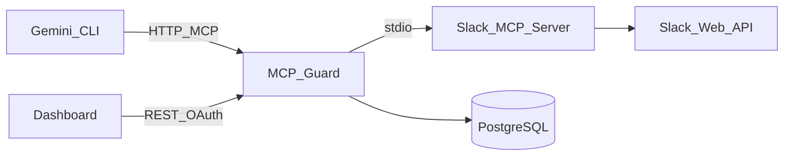

# Architecture

## Overview

MCP Guard sits between AI agents and downstream MCP tool servers. It authenticates agents, enforces policies, audits every tool call, and exposes governance APIs plus a React dashboard.

## Request Flow (tools/call)

1. Agent sends MCP `tools/call` to `/mcp` with API key
2. Gateway validates key → resolves agent + skill + owner
3. Policy engine checks skill allowlist and JSON rules
4. Audit record written (allowed / denied / error)
5. If allowed, call forwarded to Slack MCP subprocess
6. Response returned to agent

## Components

| Package | Role |
|---------|------|
| `internal/mcp` | Agent-facing MCP server + Slack client proxy |
| `internal/policy` | Skill + rule evaluation |
| `internal/audit` | Persist and export audit logs |
| `internal/auth` | API keys, JWT |
| `internal/api` | REST handlers for dashboard |
| `internal/shadow` | Shadow AI event detection |
| `web/` | React governance UI (embedded in Go binary) |

## Tool Naming

Downstream tools are prefixed: `slack.<original_name>` (e.g. `slack.conversations_history`).

## Future Extensions

- OPA/Rego policy engine
- Additional connectors (Jira, GitHub) as stdio/HTTP MCP clients
- Kubernetes deployment with connector sidecars
- Real shadow-AI detection via network/log ingestion
